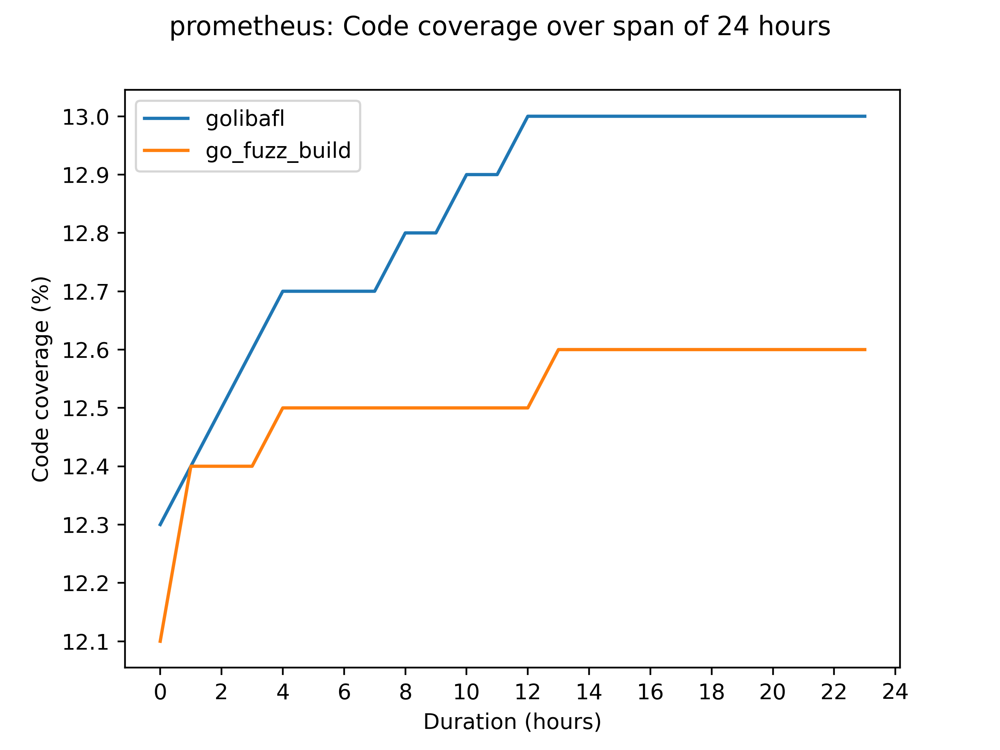

# GoLibAFL

## Introduction
This project provides a setup for fuzzing golang binaries using [LibAFL](https://github.com/AFLplusplus/LibAFL).
By leveraging Go’s native libFuzzer-compatible instrumentation (`sancov_8bit`), we enable advanced fuzzing capabilities beyond Go’s built-in fuzzing support.

- **In-process fuzzing** for maximum performance.
- **Coverage-guided fuzzing with comparison tracing support** for guided mutation.
- **Interoperability with Go** via Foreign Function Interface (FFI).

## Performance
Comparing GoLibAFL with the native libfuzzer shows great performance. Running 24h on the prometheus example:



## Installation
### Requirements
- Go 1.18 or later (recommended: latest version)
- Rust (nightly toolchain recommended for optimizations)
- Cargo and Rust toolchain installed

### Building and running a fuzzer
1. Clone the repository:
   ```sh
   git clone <repo-url>
   cd <repo-name>
   ```
2. Define your golang harness (see below)
3. Define the harness location with the environement variable `HARNESS`:
    ```sh
    export "HARNESS=examples/promql"
    ```
4. Build and run the Rust-based LibAFL fuzzer:
   ```sh
   cargo run --release -- fuzz
   ```

## Usage
### Defining a harness in Go
Implement your harness in the `LLVMFuzzerTestOneInput` function, which will be used by LibAFL:
```go
func LLVMFuzzerTestOneInput(data *C.char, size C.size_t) C.int {
   // `data` should be converted to the type you need and passed as input
   input := C.GoBytes(unsafe.Pointer(data), C.int(size))

   // function to be fuzzed, i.e `parse`
   mylib.parse(input)
}
```

For an example setup, refer to our [harness template](./harness_template/).

### Running a specific input
To execute the harness with a specific input, run:
```sh
cargo run -- run -i <path_to_input>
```
If no input path is provided, the default input directory is `./input`.

### Available options
To see the available command-line options for a subcommand, use:
```sh
cargo run -- fuzz --help
cargo run -- run --help
```

### Performance optimization
- **Use Rust nightly toolchain** for optimized memory mapping.
- **Upgrade Go to at least version 1.23** to avoid `cgo` stack bound performance issues.

## License
This project is licensed under the Apache 2.0 License.
